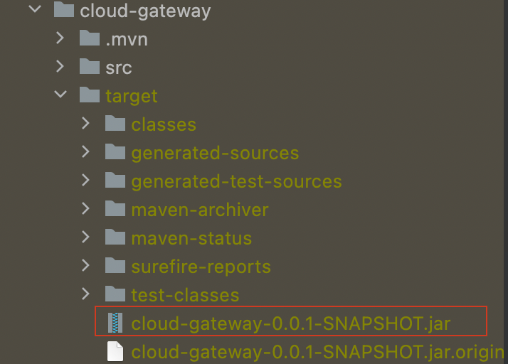
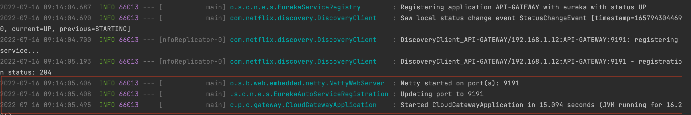

### Let's run for cloud-gateway
```
cloud-gateway git:(main) ✗ mvn clean install
```
### Once done! you get see SUCCESS Message like this for cloud-gateway


### Run the generated jar in target folder




### The follwing mvn cmd to start the server

```
target git:(main) ✗ java -jar cloud-gateway-0.0.1-SNAPSHOT.jar
```

### Once the Server is started the following are the logs




