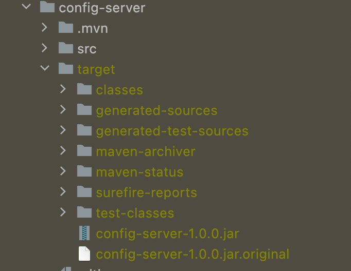

### Let's run for config-server
```
config-server git:(main) ✗ mvn clean install
```
### Once done! you get see SUCCESS Message like this for config-server


### Run the generated jar in target folder




### The follwing mvn cmd to start the server

```
target git:(main) ✗ java -jar config-server-1.0.0.jar
```

### Once the Server is started the following are the logs


