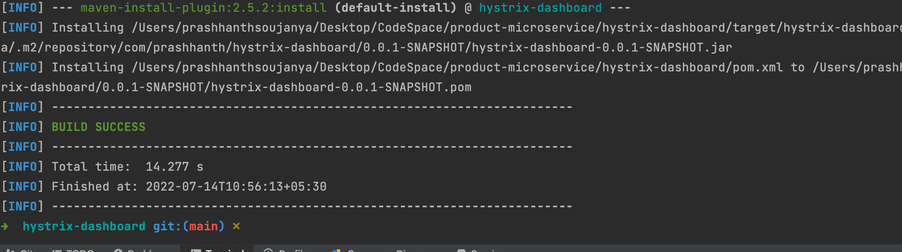

### Let's run for hystrix-dashboard
```
hystrix-dashboard git:(main) ✗ mvn clean install
```
#### Once done! you get see SUCCESS Message like this for hystrix-dashboard


### Run the generated jar in target folder


### The follwing mvn cmd to start the server

```
 target git:(main) ✗ java -jar hystrix-dashboard-0.0.1-SNAPSHOT.jar
```

### Once the Server is started the following are the logs


