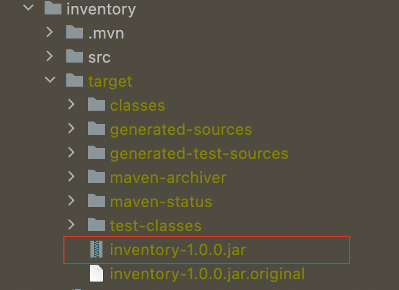
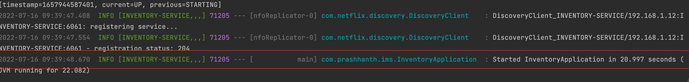

### Let's run for inventory
```
inventory git:(main) ✗ mvn clean install
```
#### Once done! you get see SUCCESS Message like this for inventory


### Run the generated jar in target folder




### The follwing mvn cmd to start the server

```
 target git:(main) ✗ java -jar products-1.0.0.jar
```

### Once the Server is started the following are the logs




