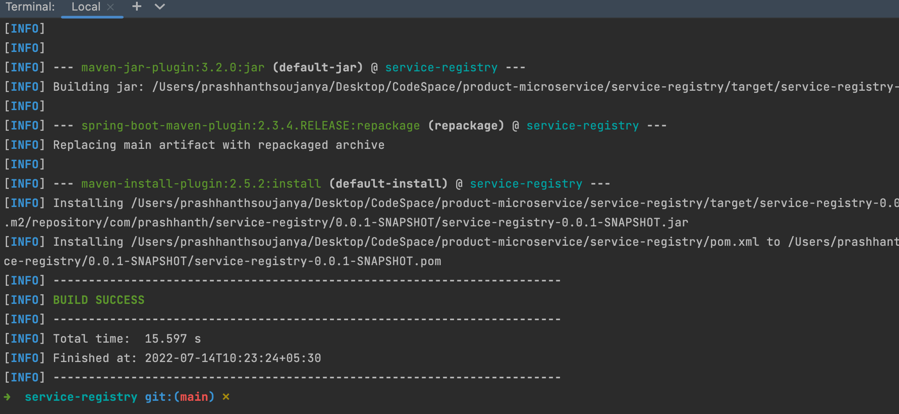
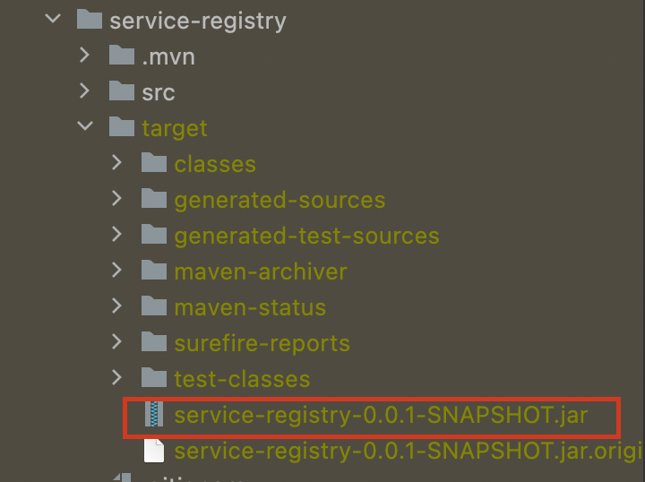
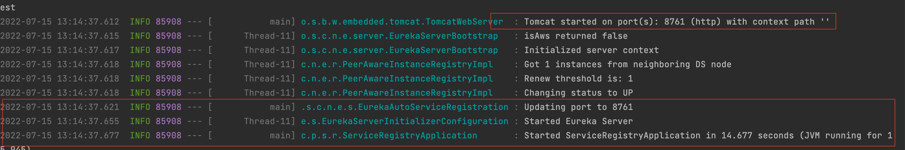

## How to run the project 

### Let's start with service-registry service

```
service-registry git:(main) ✗ mvn clean install
```
### Once done! you get see SUCCESS Message like this for service-registry


### Run the generated jar in target folder




### The follwing mvn cmd to start the server

```
target git:(main) ✗ java -jar service-registry-0.0.1-SNAPSHOT.jar 
```

### Once the Server is started the following are the logs




